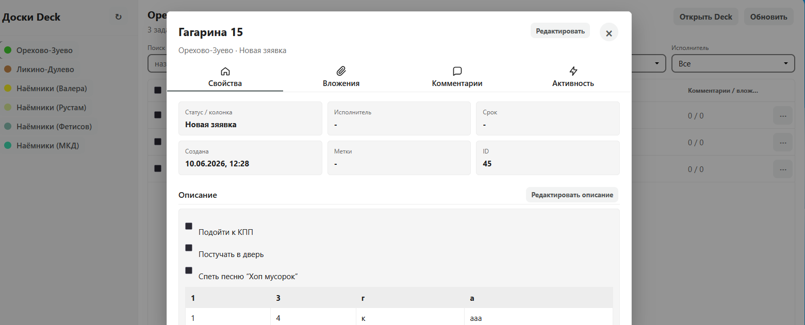

# DeckList24

DeckList24 is a separate native Nextcloud app with app id `decklist24`.

It does not replace Nextcloud Deck. It opens at `/apps/decklist24/` and uses the installed Deck app at `/apps/deck/` as the source of boards, stacks, cards, assignees and labels.

## Install in Nextcloud Snap

```bash
sudo mkdir -p /var/snap/nextcloud/current/nextcloud/extra-apps
sudo cp -a /home/boss/BACKUP-NEXTCLOUD/decklist24 /var/snap/nextcloud/current/nextcloud/extra-apps/decklist24
sudo chown -R root:root /var/snap/nextcloud/current/nextcloud/extra-apps/decklist24
sudo nextcloud.occ app:enable decklist24
sudo nextcloud.occ maintenance:mode --off
```

Deck must stay installed and enabled:

```bash
sudo nextcloud.occ app:list | grep -E "deck|decklist24"
```

Then open:

- `/apps/deck/` for the original Deck app.
- `/apps/decklist24/` for DeckList24.
